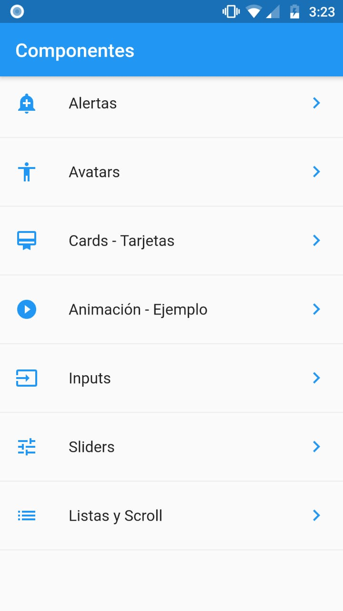

# Widgets básicos

Aplicación que maneja una lista de elementos, donde cada elementos esta conectado hacía otra pantalla y en cada pantalla se hacen uso de Widgets especiales, como: 

- alertas 
- avatars 
- tarjetas 
- animaciones
- inputs 
- listats 
- scroll 
- etc.

  

## Comenzando

Esté proyecto contiene varios ejemplos para poder familializarse con los widgets de Flutter, además que cuenta con una estructura carpetas que nos permite organizar de mejor maneras nuestros widgets. Es necesario haber instalado [Flutter](https://flutter.dev/docs/get-started) posteriormente.

## Requerimientos
  - Android Studio
  - Java JDK 8
  - Flutter
  - Plugins para Android Studio
    - Flutter
    - Dart
  - Emulador de android o dispositivo de android.

  - Se Recomienda usar Visual Studio Code, aunque se puede usar un android studio o cualquier otro editor de texto.

## License
[MIT](https://choosealicense.com/licenses/mit/)